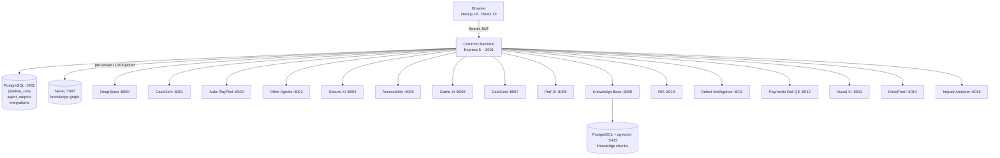

# Architecture

## Service map



## Service ports

| Service | Port | Stack |
|---|---|---|
| Frontend | `3000` | Next.js 16 · React 19 |
| Common Backend | `3001` | Node 22 · Express 5 · Prisma 7 |
| DeepSpeci | `8000` | Python · FastAPI · LangGraph |
| CaseGeni | `8001` | Python · FastAPI |
| Auto-PlayPilot | `8002` | Node · Express · Playwright |
| Other Agents (Predictive, Test Optimization, Knowledge Graph) | `8003` | Next.js |
| Secure-Xi | `8004` | Python · FastAPI |
| Accessibility Intelligence | `8005` | Node · Express · axe-core |
| Game-Xi | `8006` | Python · FastAPI |
| DataGeni | `8007` | Python · FastAPI |
| Perf-Xi | `8008` | Python · FastAPI |
| Knowledge Base | `8009` | Python · FastAPI · pgvector |
| RIA (ZenRia) | `8010` | Python · FastAPI |
| Defect Intelligence | `8011` | Python · FastAPI |
| Payments Rail QE | `8012` | Python · FastAPI |
| Visual Xi | `8013` | Python · FastAPI · Playwright runner |
| DocuProof | `8014` | Python · FastAPI · pdfplumber |
| Impact Analyzer | `8015` | Python · FastAPI |

**Test Reviewer** and **Insights360** run entirely in the frontend and have no upstream service.

## Datastores

| Store | Port | Container | Purpose |
|---|---|---|---|
| PostgreSQL | `5432` | `zenseai-backend-db` | Auth, projects, pipelines, agent outputs, encrypted integrations |
| PostgreSQL + pgvector | `5433` | `zenseai-knowledge-db` | Knowledge Base embeddings |
| Neo4j | `7687` | `zenseai-neo4j` | Knowledge Graph persistence |

All three are provisioned as Podman containers by `make install`.

## Request flow

1. Browser calls `/api/...` on Common Backend with a Bearer JWT
2. Backend resolves the tenant's encrypted LLM config (AES-256-GCM `v1:iv:tag:ct`)
3. Backend decrypts in-process and merges into the upstream agent request
4. Agent streams progress via SSE → backend proxies back to browser
5. Final result is persisted to `agent_outputs` and the pipeline run record is updated

Raw API keys never reach the browser. Source-integration tokens (Jira, Git, qTest) are resolved server-side on the same principle.

## Multi-mode agents

Several agents expose more than one flow. The backend routes these through a named sub-path selected by the workspace:

| Agent | Modes |
|---|---|
| **Auto-PlayPilot** | Framework and Script Generation · Test Script Generation · Test Execution · Test Code Conversion *(not yet enabled)* |
| **Perf-Xi** | Workload Modeling (greenfield / brownfield) · Script Automation · Anomaly Detection Engine · Journey Identifier · Strategy Document |
| **Visual Xi** | Single and batch runs · Visual Eyes comparison · AI analysis · reports · ignore regions · cloud devices |
| **Payments Rail QE** | Scenario generation · conversational mode |

## Platform surfaces

Beyond the agent workspaces, the product provides:

| Surface | Purpose |
|---|---|
| **QI Foundry** | Sector-aware agent catalogue, filterable by persona |
| **QI Projects** | Projects, pipelines and run history |
| **QI PromptHub** | Prompt library with Assistant, My Prompts, Community and Sector Packs, plus Journey Identifier and Strategy Document |
| **Knowledge Base** | Ingestion, connectors and graph exploration |
| **Insights360** | Quality analytics and agent adoption reporting |
| **Integrations** | Credential management for LLM providers and 21 external tools |

## Sectors

Projects are scoped to an industry sector, which tailors the agent catalogue and the policy packs applied by [Test Reviewer](../agents/test-reviewer.md):

| Code | Sector |
|---|---|
| `bfsi` | Banking, Financial Services & Insurance |
| `mcs` | Manufacturing, Consumer & Services |
| `hls` | Healthcare & Life Sciences |
| `tmt` | Telecom, Media & Technology |

## Frontend cache model

| Layer | Lives in | Purpose |
|---|---|---|
| `pipelineDataCache` (memory) | Page session | Hot reads for components |
| Backend (`pipeline_runs`, `agent_outputs`) | PostgreSQL | Source of truth — survives reloads |
| `sessionStorage.pipelineContext` | Tab | Current `pipelineRunId` |

`hydrateProjectFromBackendAsync()` reconciles on every project/pipeline mount, with per-runId guards to preserve optimistic local writes (e.g. just-validated outputs).

## Pipeline dependencies (frontend-enforced)

```
deepspeci → casegeni → auto-playpilot → defect-intelligence → knowledge-graph → impact-analyzer
                    ↘ datageni
                    ↘ test-reviewer
```

Independent agents (Secure-Xi, Perf-Xi, Accessibility Intelligence, Visual Xi, Game-Xi, Payments Rail QE, DocuProof) have no upstream requirement.
