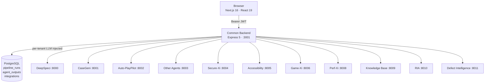

# Architecture

## Service map



## Request flow

1. Browser calls `/api/...` on Common Backend with a Bearer JWT
2. Backend resolves the tenant's encrypted LLM config (AES-256-GCM `v1:iv:tag:ct`)
3. Backend decrypts in-process and merges into the upstream agent request
4. Agent streams progress via SSE → backend proxies back to browser
5. Final result is persisted to `agent_outputs` and the pipeline run record is updated

Raw API keys never reach the browser.

## Frontend cache model

| Layer | Lives in | Purpose |
|---|---|---|
| `pipelineDataCache` (memory) | Page session | Hot reads for components |
| Backend (`pipeline_runs`, `agent_outputs`) | PostgreSQL | Source of truth — survives reloads |
| `sessionStorage.pipelineContext` | Tab | Current `pipelineRunId` |

`hydrateProjectFromBackendAsync()` reconciles on every project/pipeline mount, with per-runId guards to preserve optimistic local writes (e.g. just-validated outputs).

## Pipeline dependencies (frontend-enforced)

```
deepspeci → casegeni → auto-playpilot → defect-intelligence
                    ↘ datageni
                    ↘ test-reviewer
```

Independent agents (Secure-Xi, Perf-Xi, Accessibility, Visual Detector, Game-Xi, Payments-Rail) have no upstream requirement.
