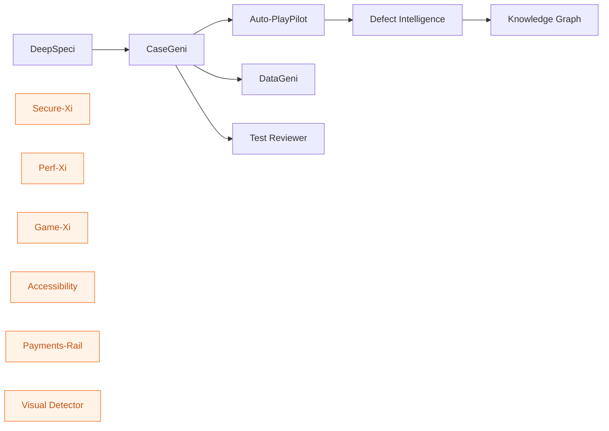

# Agents

ZenseAI.QI ships 12+ specialised AI agents, each addressing one slice of the QE lifecycle. Agents are **independent services** behind the Common Backend — you compose them into pipelines as you need.

## By stage

| Stage | Agents |
|---|---|
| **Requirements & Specs** | [DeepSpeci](deepspeci.md) · [RIA](ria.md) · [Test Reviewer](test-reviewer.md) |
| **Test Design** | [CaseGeni](casegeni.md) · [DataGeni](datageni.md) |
| **Automation** | [Auto-PlayPilot](auto-playpilot.md) · [Visual Detector](visual-detector.md) |
| **Quality Intelligence** | [Defect Intelligence](defect-intelligence.md) · [Predictive Intelligence](predictive-intelligence.md) · [Test Optimization](test-optimization.md) · [Knowledge Graph](knowledge-graph.md) |
| **Specialised** | [Secure-Xi](secure-xi.md) · [Perf-Xi](perf-xi.md) · [Game-Xi](game-xi.md) · [Accessibility](accessibility.md) · [Payments-Rail](payments-rail.md) |
| **Platform** | [Knowledge Base](knowledge-base.md) |

## Dependency graph

The pipeline runner enforces these dependencies — downstream agents can only run when their upstream output is **validated**.

Standalone agents (orange) require no upstream and can run any time.

## Common patterns

Every agent exposes:

- **`POST /process/stream` (or `/generate/stream`)** — Server-Sent Events with `progress`, `stage`, `complete`, `error`
- **`GET /health`** — liveness probe
- **Per-tenant LLM injection** — the Common Backend resolves and decrypts API keys per-request; raw keys never reach the agent process from the browser

See [Architecture](../about/architecture.md) for the full request flow.
