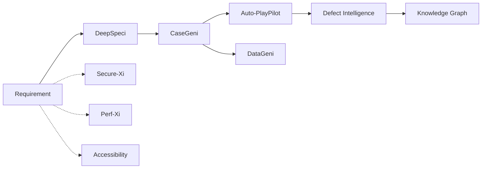

---
hide:
  - navigation
  - toc
---

# ZenseAI.QI

**AI-powered Quality Engineering — 12+ specialised agents orchestrated into a single, governed pipeline.**

From a raw requirement to an executed, validated, defect-classified test run — no copy-paste between tools.

  12 agents
  Multi-LLM routing
  SSE streaming
  Tenant-isolated
  Self-hostable

## What is ZenseAI.QI?

A unified AI-driven QE accelerator that takes a software requirement and walks it through every quality stage — clarification, test case generation, test data synthesis, script generation, execution, defect triage, performance and security validation — using purpose-built AI agents that talk to each other through a typed, validated pipeline.

[:material-rocket-launch: Latest release notes](releases/2026-05.md){ .md-button .md-button--primary }
[:material-puzzle: Browse agents](agents/index.md){ .md-button }
[:material-graph: See pipeline workflows](workflows/end-to-end.md){ .md-button }

## What's new in May 2026 latest

- :material-check-decagram: **Pending-Review race fix**

    Validated agent runs no longer flip back to "Pending Review" after navigation. Per-pipeline mirror now preserves `validated=true` against runId-matched hydration.

- :material-file-document-edit: **Auto-PlayPilot label cleanup**

    "Test Script Generation (Existing Framework)" → simply **"Test Script Generation"**. The mode covers both fresh frameworks and existing-project uploads.

- :material-database-remove: **One run-report per generation**

    Auto-PlayPilot's `save-config` step no longer persists a phantom AgentOutput row — generate emits exactly one run report per click.

- :material-cog-sync: **Phase-3 backend canonical**

    `pipeline_runs` and `agent_outputs` are now the single source of truth; the frontend localStorage layer is a hot cache that survives offline backend.

[See full May 2026 release notes →](releases/2026-05.md)

## The agent catalogue

- :material-clipboard-text-search: **[DeepSpeci](agents/deepspeci.md)**

    Turns ambiguous requirements into refined user stories, with ambiguities flagged for clarification.

- :material-format-list-checks: **[CaseGeni](agents/casegeni.md)**

    Generates structured test cases (positive, negative, edge) from refined stories.

- :material-database-cog: **[DataGeni](agents/datageni.md)**

    Synthesises rule-compliant test data from a test case set.

- :material-robot-happy: **[Auto-PlayPilot](agents/auto-playpilot.md)**

    Generates Playwright/Cypress scripts and runs them headlessly via MCP. Two modes: fresh framework scaffolding or generation into an existing project.

- :material-eye-check: **[Visual Detector](agents/visual-detector.md)**

    Pixel & layout drift detection across builds.

- :material-bug-check: **[Defect Intelligence](agents/defect-intelligence.md)**

    Classifies failed runs, clusters duplicates, suggests root cause.

- :material-chart-bell-curve: **[Predictive Intelligence](agents/predictive-intelligence.md)**

    Flags risky modules from churn + failure history before tests run.

- :material-tune-variant: **[Test Optimization](agents/test-optimization.md)**

    Selects the minimum test subset that retains coverage for a code change.

- :material-graph: **[Knowledge Graph](agents/knowledge-graph.md)**

    Builds traceability between requirements, tests, defects and code.

- :material-shield-lock: **[Secure-Xi](agents/secure-xi.md)**

    OWASP/ASVS scan + AI-driven exploit reasoning.

- :material-speedometer: **[Perf-Xi](agents/perf-xi.md)**

    Load-test plan synthesis and bottleneck explanation.

- :material-gamepad-variant: **[Game-Xi](agents/game-xi.md)**

    Game-flow + rule-coverage validator.

- :material-human-wheelchair: **[Accessibility](agents/accessibility.md)**

    axe-core audit + AI remediation guidance.

- :material-credit-card-check: **[Payments-Rail](agents/payments-rail.md)**

    Payment-spec validation (ISO20022, card schemes).

- :material-account-tie-voice: **[RIA](agents/ria.md)**

    Requirements Intelligence Assistant — conversational requirement intake.

- :material-book-open-page-variant: **[Knowledge Base](agents/knowledge-base.md)**

    pgvector-backed RAG store every agent reads from.

- :material-account-supervisor: **[Test Reviewer](agents/test-reviewer.md)**

    Reviews and scores generated test cases for quality.

## The pipeline

[Read the full architecture →](about/architecture.md)
