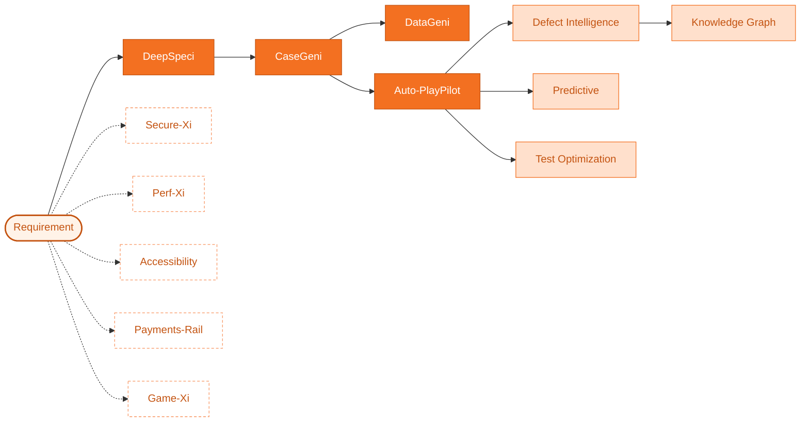

---
hide:
  - navigation
  - toc
---

Zensar QE CoE · Release Hub

# ZenseAI.QI { .hero-title }

AI-powered Quality Engineering. **12+ specialised agents** orchestrated into one governed pipeline — from a raw requirement to an executed, validated, defect-classified test run.
{ .hero-lede }

[:material-rocket-launch: May 2026 release](releases/2026-05.md){ .md-button .md-button--primary }
[:material-graph: See the pipeline](workflows/end-to-end.md){ .md-button }
[:material-puzzle: Browse agents](agents/index.md){ .md-button }
{ .hero-ctas }

:material-circle-medium: Multi-LLM routing
:material-circle-medium: SSE streaming
:material-circle-medium: Tenant-isolated
:material-circle-medium: Self-hostable
:material-circle-medium: OWASP-aligned
{ .badges }

12+Specialised agents

7LLM providers routable

SSEReal-time streaming

AES-256GCM-encrypted secrets

## One requirement in. A validated test run out. { .section-title }

ZenseAI.QI is a unified, multi-tenant accelerator that walks a software requirement through **every quality stage** — clarification, test-case generation, test-data synthesis, script generation, execution, defect triage, performance and security validation — using purpose-built AI agents that talk to each other through a typed, validated pipeline.
{ .section-lede }

- :material-flash:{ .lg .middle } **Faster cycle time**

    ---

    From requirement to executed regression in hours, not sprints. Agents pass typed outputs — no copy-paste between tools.

- :material-shield-check:{ .lg .middle } **Governed by design**

    ---

    AES-256-GCM secrets, JWT auth, row-level tenant isolation, OWASP-aligned hardening. Pipeline runs are auditable end-to-end.

- :material-puzzle-plus:{ .lg .middle } **Composable agents**

    ---

    Pick the agents your project needs. Each has its own UI, evidence trail, and a standard contract for upstream / downstream.

- :material-brain:{ .lg .middle } **Bring your own LLM**

    ---

    Per-tenant routing across Gemini, OpenAI, Claude, Mistral, Ollama and more. Keys stay encrypted; raw secrets never reach the browser.

## The pipeline at a glance { .section-title }

Solid arrows = mandatory dependencies. Dashed = independent specialised agents.

[Walk the end-to-end workflow](workflows/end-to-end.md){ .md-button .md-button--primary }
[Read the architecture](about/architecture.md){ .md-button }

## What's new in May 2026 latest { .section-title }

- :material-check-decagram:{ .lg .middle } **Pending-Review race fix**

    ---

    Validated agent runs no longer flip back to *Pending Review* after navigation. Per-pipeline mirror now preserves `validated=true` against runId-matched hydration.

- :material-file-document-edit:{ .lg .middle } **Auto-PlayPilot label cleanup**

    ---

    *"Test Script Generation (Existing Framework)"* is now simply **Test Script Generation** — the mode covers fresh scaffolding and existing-project uploads.

- :material-database-remove:{ .lg .middle } **One run-report per generation**

    ---

    Auto-PlayPilot's `save-config` step no longer persists a phantom AgentOutput row — generate emits exactly one run report per click.

- :material-cog-sync:{ .lg .middle } **Phase-3 backend canonical**

    ---

    `pipeline_runs` and `agent_outputs` are the single source of truth; the frontend localStorage layer is a hot cache that survives offline backend.

[Read full May 2026 notes](releases/2026-05.md){ .md-button .md-button--primary }

## The agent catalogue { .section-title }

Requirements &amp; Specs

- :material-clipboard-text-search:{ .lg .middle } **[DeepSpeci](agents/deepspeci.md)**

    ---

    Turns ambiguous requirements into refined user stories with clarifying questions surfaced.

- :material-format-list-checks:{ .lg .middle } **[CaseGeni](agents/casegeni.md)**

    ---

    Generates structured positive, negative and edge-case tests from refined stories.

- :material-account-supervisor:{ .lg .middle } **[Test Reviewer](agents/test-reviewer.md)**

    ---

    Reviews and scores generated test cases for quality, completeness and risk.

- :material-account-tie-voice:{ .lg .middle } **[RIA](agents/ria.md)**

    ---

    Requirements Intelligence Assistant — conversational requirement intake.

Test Data &amp; Automation

- :material-database-cog:{ .lg .middle } **[DataGeni](agents/datageni.md)**

    ---

    Synthesises rule-compliant test data from a test-case set.

- :material-robot-happy:{ .lg .middle } **[Auto-PlayPilot](agents/auto-playpilot.md)**

    ---

    Generates Playwright / Cypress scripts and runs them headlessly via MCP.

- :material-eye-check:{ .lg .middle } **[Visual Detector](agents/visual-detector.md)**

    ---

    Pixel and layout drift detection across builds.

Quality Intelligence

- :material-bug-check:{ .lg .middle } **[Defect Intelligence](agents/defect-intelligence.md)**

    ---

    Classifies failed runs, clusters duplicates, suggests root cause.

- :material-chart-bell-curve:{ .lg .middle } **[Predictive Intelligence](agents/predictive-intelligence.md)**

    ---

    Flags risky modules from churn + failure history before tests run.

- :material-tune-variant:{ .lg .middle } **[Test Optimization](agents/test-optimization.md)**

    ---

    Selects the minimum test subset that retains coverage for a code change.

- :material-graph:{ .lg .middle } **[Knowledge Graph](agents/knowledge-graph.md)**

    ---

    Builds traceability between requirements, tests, defects and code.

Specialised Validators

- :material-shield-lock:{ .lg .middle } **[Secure-Xi](agents/secure-xi.md)**

    ---

    OWASP / ASVS scan with AI-driven exploit reasoning.

- :material-speedometer:{ .lg .middle } **[Perf-Xi](agents/perf-xi.md)**

    ---

    Load-test plan synthesis and bottleneck explanation.

- :material-gamepad-variant:{ .lg .middle } **[Game-Xi](agents/game-xi.md)**

    ---

    Game-flow and rule-coverage validator.

- :material-human-wheelchair:{ .lg .middle } **[Accessibility](agents/accessibility.md)**

    ---

    axe-core audit with AI remediation guidance.

- :material-credit-card-check:{ .lg .middle } **[Payments-Rail](agents/payments-rail.md)**

    ---

    Payment-spec validation (ISO20022, card schemes).

Platform

- :material-book-open-page-variant:{ .lg .middle } **[Knowledge Base](agents/knowledge-base.md)**

    ---

    pgvector-backed RAG store every agent reads from.

## Ready to put it to work? { .section-title }

Explore the workflows your team will run most often, then drill into the agents that power each step.
{ .section-lede }

[Requirement → Test](workflows/requirement-to-test.md){ .md-button .md-button--primary }
[Regression](workflows/regression.md){ .md-button .md-button--primary }
[Exploratory](workflows/exploratory.md){ .md-button .md-button--primary }
[Architecture deep-dive](about/architecture.md){ .md-button }
{ .hero-ctas }

