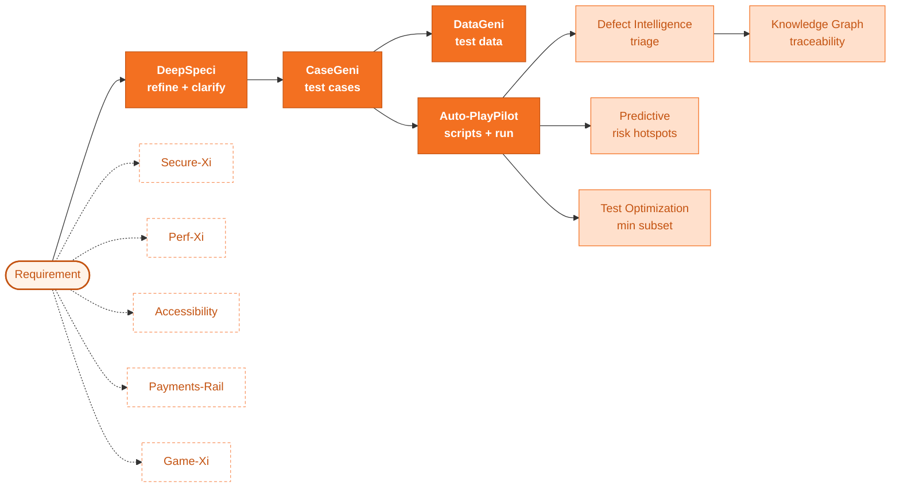

---
hide:
  - navigation
  - toc
---

  

  

  Zensar QE CoE · Release Hub

  # ZenseAI.QI

  

    AI-powered Quality Engineering. <b>12+ specialised agents</b>
    orchestrated into one governed pipeline — from a raw requirement
    to an executed, validated, defect-classified test run.
  

  

    <a href="releases/2026-05/" class="md-button md-button--primary">:material-rocket-launch: May 2026 release</a>
    <a href="workflows/end-to-end/" class="md-button">:material-graph: See the pipeline</a>
    <a href="agents/" class="md-button">:material-puzzle: Browse agents</a>
  

  

     Multi-LLM routing
     SSE streaming
     Tenant-isolated
     Self-hostable
     OWASP-aligned
  

  

  
12+Specialised agents

  
7LLM providers routable

  
SSEReal-time streaming

  
100%AES-256-GCM secrets

<section class="band band--soft" markdown>

## One requirement in. A validated test run out. { .section-title }

ZenseAI.QI is a unified, multi-tenant accelerator that walks a software requirement through **every quality stage** — clarification, test case generation, test data synthesis, script generation, execution, defect triage, performance and security validation — using purpose-built AI agents that talk to each other through a typed, validated pipeline.

- :material-flash: **Faster cycle time**

    From requirement to executed regression in hours, not sprints. Agents pass typed outputs — no copy-paste between tools.

- :material-shield-check: **Governed by design**

    AES-256-GCM secrets, JWT auth, row-level tenant isolation, OWASP-aligned hardening. Pipeline runs are auditable end-to-end.

- :material-puzzle-plus: **Composable agents**

    Pick the agents your project needs. Each one has its own UI, its own evidence, and a standard contract for upstream / downstream.

- :material-brain: **Bring your own LLM**

    Per-tenant routing across Gemini, OpenAI, Claude, Mistral, Ollama and more. Keys stay encrypted; raw secrets never reach the browser.

</section>

<section class="band" markdown>

## The pipeline at a glance { .section-title }

Solid arrows = mandatory dependencies. Dashed = independent specialised agents that attach anywhere in the flow.

<a href="workflows/end-to-end/" class="md-button md-button--primary">Walk the full end-to-end workflow</a>
<a href="about/architecture/" class="md-button">Read the architecture</a>

</section>

<section class="band band--soft" markdown>

## What's new in May 2026 latest { .section-title }

- :material-check-decagram: **Pending-Review race fix**

    Validated agent runs no longer flip back to *Pending Review* after navigation. Per-pipeline mirror now preserves `validated=true` against runId-matched hydration.

- :material-file-document-edit: **Auto-PlayPilot label cleanup**

    *“Test Script Generation (Existing Framework)”* is now simply **Test Script Generation** — the mode covers both fresh scaffolding and existing-project uploads.

- :material-database-remove: **One run-report per generation**

    Auto-PlayPilot’s `save-config` step no longer persists a phantom AgentOutput row — generate emits exactly one run report per click.

- :material-cog-sync: **Phase-3 backend canonical**

    `pipeline_runs` and `agent_outputs` are the single source of truth; the frontend localStorage layer is a hot cache that survives offline backend.

<a href="releases/2026-05/" class="md-button md-button--primary">Read full May 2026 notes →</a>

</section>

<section class="band" markdown>

## The agent catalogue { .section-title }

<h3 class="cat-heading">Requirements &amp; Specs</h3>

- :material-clipboard-text-search: **[DeepSpeci](agents/deepspeci.md)**

    Turns ambiguous requirements into refined user stories with clarifying questions surfaced.

- :material-format-list-checks: **[CaseGeni](agents/casegeni.md)**

    Generates structured positive, negative and edge-case tests from refined stories.

- :material-account-supervisor: **[Test Reviewer](agents/test-reviewer.md)**

    Reviews and scores generated test cases for quality, completeness and risk.

- :material-account-tie-voice: **[RIA](agents/ria.md)**

    Requirements Intelligence Assistant — conversational requirement intake.

<h3 class="cat-heading">Test Data &amp; Automation</h3>

- :material-database-cog: **[DataGeni](agents/datageni.md)**

    Synthesises rule-compliant test data from a test case set.

- :material-robot-happy: **[Auto-PlayPilot](agents/auto-playpilot.md)**

    Generates Playwright / Cypress scripts and runs them headlessly via MCP — fresh scaffolding or into an existing project.

- :material-eye-check: **[Visual Detector](agents/visual-detector.md)**

    Pixel and layout drift detection across builds.

<h3 class="cat-heading">Quality Intelligence</h3>

- :material-bug-check: **[Defect Intelligence](agents/defect-intelligence.md)**

    Classifies failed runs, clusters duplicates, suggests root cause.

- :material-chart-bell-curve: **[Predictive Intelligence](agents/predictive-intelligence.md)**

    Flags risky modules from churn + failure history before tests run.

- :material-tune-variant: **[Test Optimization](agents/test-optimization.md)**

    Selects the minimum test subset that retains coverage for a code change.

- :material-graph: **[Knowledge Graph](agents/knowledge-graph.md)**

    Builds traceability between requirements, tests, defects and code.

<h3 class="cat-heading">Specialised Validators</h3>

- :material-shield-lock: **[Secure-Xi](agents/secure-xi.md)**

    OWASP / ASVS scan with AI-driven exploit reasoning.

- :material-speedometer: **[Perf-Xi](agents/perf-xi.md)**

    Load-test plan synthesis and bottleneck explanation.

- :material-gamepad-variant: **[Game-Xi](agents/game-xi.md)**

    Game-flow and rule-coverage validator.

- :material-human-wheelchair: **[Accessibility](agents/accessibility.md)**

    axe-core audit with AI remediation guidance.

- :material-credit-card-check: **[Payments-Rail](agents/payments-rail.md)**

    Payment-spec validation (ISO20022, card schemes).

<h3 class="cat-heading">Platform</h3>

- :material-book-open-page-variant: **[Knowledge Base](agents/knowledge-base.md)**

    pgvector-backed RAG store every agent reads from.

</section>

<section class="cta-band" markdown>

## Ready to put it to work? { .section-title }

Explore the workflows your team will run most often, then drill into the agents that power each step.

  <a href="workflows/requirement-to-test/" class="md-button md-button--primary">Requirement → Test</a>
  <a href="workflows/regression/" class="md-button md-button--primary">Regression</a>
  <a href="workflows/exploratory/" class="md-button md-button--primary">Exploratory</a>
  <a href="about/architecture/" class="md-button">Architecture deep-dive</a>

</section>
