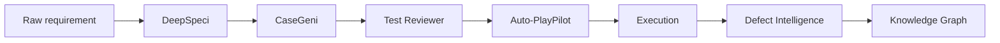

# End-to-end Pipeline

The flagship workflow — from raw requirement to executed, triaged regression in one continuous stream.

## Steps

1. **DeepSpeci** — paste/upload the requirement, validate the refined stories
2. **CaseGeni** — generate test cases, validate
3. **Test Reviewer** — optional but recommended quality gate
4. **Auto-PlayPilot — Test Script Generation** — generate against your existing framework
5. **Auto-PlayPilot — Execution** — run headlessly via MCP
6. **Defect Intelligence** — classify any failures
7. **Knowledge Graph** — auto-link everything for traceability

## Validation gates

Each step has a **Validate** action that locks the output and unlocks downstream. The validated state is cached locally and reconciled with the backend on every page load (see the May 2026 race-fix note).

<!-- SCREENSHOT: workflow-e2e-01-pipeline-view.png — Full pipeline view with all 7 nodes -->
<!-- SCREENSHOT: workflow-e2e-02-run-history.png — Run history showing PIP001, PIP002, … -->

## When to use

- Designing a new feature end-to-end
- Demos and POCs
- Onboarding new testers to the workflow
