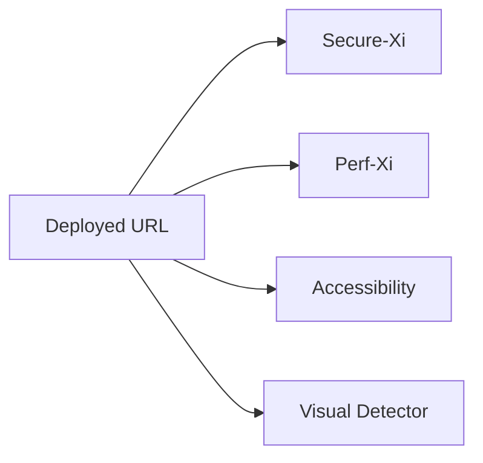

# Exploratory

Independent agent sweep across a deployed environment — no upstream dependency, run any time.

## When to use

- Pre-release environment validation
- Periodic non-functional health-checks
- Independent audit by the QE CoE

<!-- SCREENSHOT: workflow-exploratory-01-multi.png — Four agents running in parallel against one target -->
