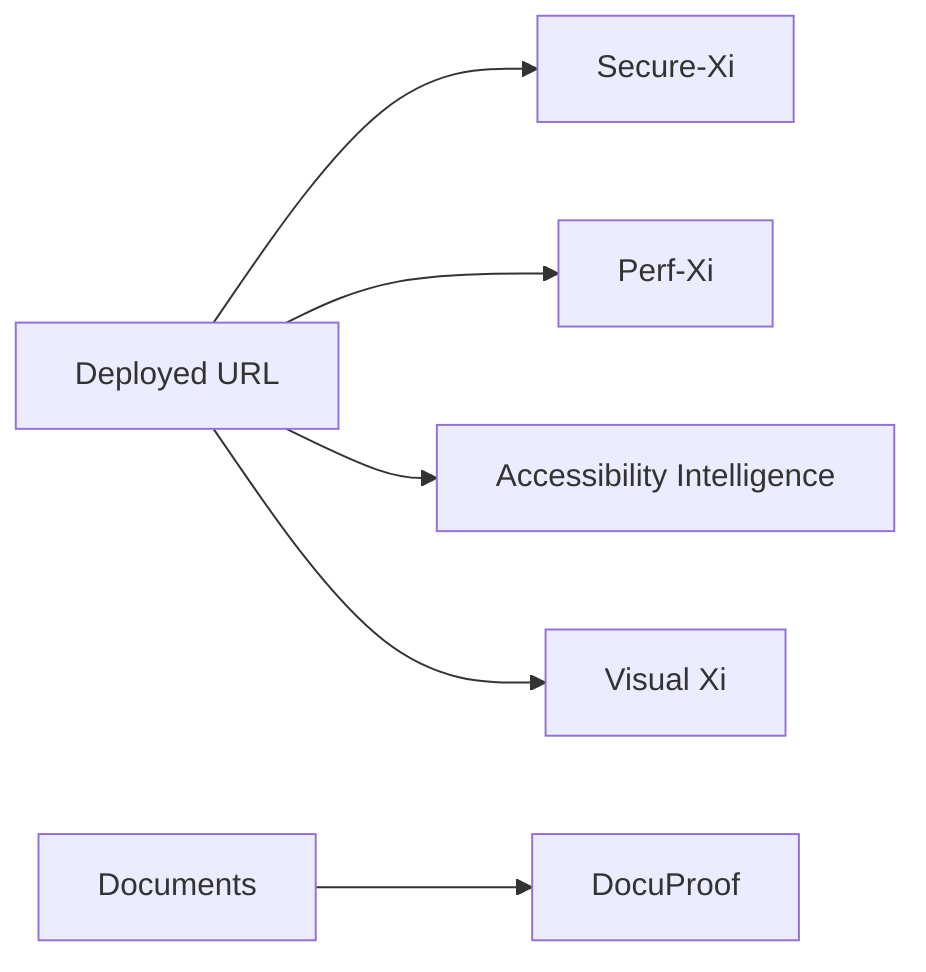

# Exploratory

Independent agent sweep across a deployed environment — no upstream dependency, run any time.

## What each agent needs

| Agent | Input |
|---|---|
| [Secure-Xi](../agents/secure-xi.md) | Deployed URL, or an OpenAPI specification |
| [Perf-Xi](../agents/perf-xi.md) | A journey definition, or existing results for anomaly analysis |
| [Accessibility Intelligence](../agents/accessibility.md) | URL or page list, plus a crawl depth |
| [Visual Xi](../agents/visual-detector.md) | Figma design reference paired with the live URL |
| [DocuProof](../agents/pdf-validator.md) | Baseline and candidate documents |

## When to use

- Pre-release environment validation
- Periodic non-functional health-checks
- Independent audit by the QE CoE
- Document and design sign-off ahead of a release

<!-- SCREENSHOT: workflow-exploratory-01-multi.png — Several independent agents running against one target -->
