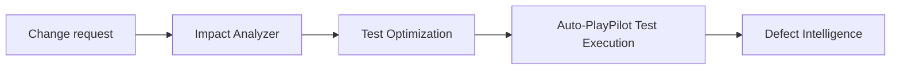

# Regression

Change-scoped regression — work out what a change affects, rationalise the suite, run it, and triage the failures.



## Steps

1. **[Impact Analyzer](../agents/impact-analyzer.md)** — describe the change; get the impacted tests ranked by priority, plus the coverage gaps and new tests needed
2. **[Test Optimization](../agents/test-optimization.md)** — remove redundancy from the resulting set so you run coverage, not duplicates
3. **[Auto-PlayPilot — Test Execution](../agents/auto-playpilot.md)** — run the selected tests, by file, suite or `@tag`
4. **[Defect Intelligence](../agents/defect-intelligence.md)** — cluster the failures and separate real regressions from noise

[Predictive Intelligence](../agents/predictive-intelligence.md) can be added before execution to flag tests unlikely to pass, so they are refined rather than run.

## When to use

- A change request lands and you need to scope the regression effort defensibly
- Before a release, to re-run what the sprint's changes actually touched
- Inherited suites where nobody is confident which tests cover what

## Prerequisites

Impact analysis reads the [Knowledge Graph](../agents/knowledge-graph.md), so build the graph over your requirements and test estate first — the ranking is only as good as the relationships behind it.

## Running it

Pipelines are composed and run from the workspace. The **Regression Suite Refresh** and **Failure Triage Pack** templates in the [template catalogue](index.md#template-catalogue) provide starting points.

Runs can also be driven through the Common Backend API:

```bash
# Create a run, then execute it
curl -X POST $ZENSEAI_QI/api/pipeline-runs \
  -H "Authorization: Bearer $TOKEN" \
  -H "Content-Type: application/json" \
  -d '{"pipelineId": "<pipeline-id>"}'

curl -X POST $ZENSEAI_QI/api/pipeline-runs/<run-id>/execute \
  -H "Authorization: Bearer $TOKEN"
```

!!! note "No CI trigger yet"
    There is no pull-request webhook or CI status-check integration in the current release. Regression runs are initiated from the workspace or through the API above.

<!-- SCREENSHOT: workflow-regression-01-impact-scope.png — Impact Analyzer output scoping the regression set -->
