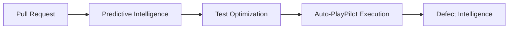

# Regression

PR-time selective regression powered by Predictive + Test Optimization.



## When to use

- Every PR — runs in minutes instead of hours
- Pre-merge gate in CI

## Setup

Trigger via the Common Backend's webhook endpoint from your CI:

```bash
curl -X POST $ZENSEAI_QI/api/pipelines/regression/run \
  -H "Authorization: Bearer $TOKEN" \
  -d '{"prUrl": "https://github.com/.../pull/123"}'
```

<!-- SCREENSHOT: workflow-regression-01-pr-status.png — GitHub PR status check populated by ZenseAI.QI -->
