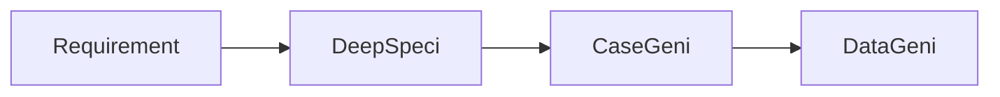

# Requirement → Test

Lightweight workflow that stops at validated test cases + data, leaving execution to your existing test process.

## When to use

- Manual test teams (you want cases + data, not scripts)
- Migrating a legacy suite — generate AI cases, diff against existing
- Stakeholder review before committing to automation

<!-- SCREENSHOT: workflow-r2t-01-export.png — Export to CSV / Jira / Azure -->
