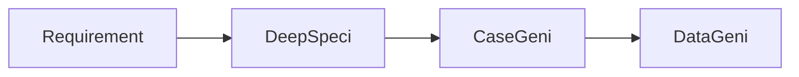

# Requirement → Test

Lightweight workflow that stops at validated test cases + data, leaving execution to your existing test process.

## When to use

- Manual test teams (you want cases + data, not scripts)
- Migrating a legacy suite — generate AI cases, diff against existing
- Stakeholder review before committing to automation

## Getting the output out

Test cases export to **Excel** and **CSV**, with steps, expected results and preconditions in separate columns, and can be pushed directly to **qTest**. DeepSpeci can also migrate an existing Jira or qTest estate in and push the refined result back.

The **Test Case Generation from Requirements** template in the [template catalogue](index.md#template-catalogue) is the quickest way to start this workflow.

<!-- SCREENSHOT: workflow-r2t-01-export.png — Export to Excel / CSV / qTest -->
